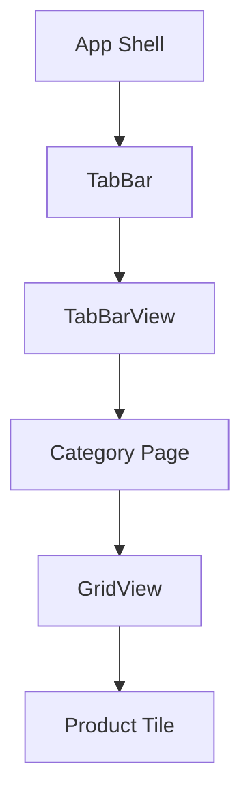

# Donut Delivery — Sweet Donuts Delivery App 🍩🚚

An attractive, colorful Flutter delivery app showcasing delicious donuts. Browse categories, view product tiles, and add treats to your cart — built with responsive layouts and smooth tab navigation.

## ✨ Quick features (short)
- Responsive product grid with clean tiles
- Category tabs with animated selection and dedicated tab views
- Product cards with image, price badge and quick Add action
- Simple cart affordance and bright, material-inspired UI

## 🧱 Main widgets & UI building blocks
Here are the primary widgets used and what they do in the app:

- GridView + SliverGridDelegate
  - Presents products in a responsive grid. Controls column count, spacing and aspect ratio so donut tiles look balanced on different screens.

- TabBar + TabBarView
  - Top category tabs let users switch between product categories. `TabBarView` keeps content synchronized and provides swipe navigation between tabs.

- Custom Tabs (Tiles)
  - Each tab uses a custom `MyTab` widget that shows an icon inside a rounded box and a label underneath. The selected tab style (border, color) is handled by the widget for a polished appearance.

- Product Tiles / Cards
  - Each tile (implemented as `DonutTile`) contains: image, price badge, product name, store, favorite icon and 'Add' action. Tiles are laid out inside the GridView.

## 🛠️ Technologies & setup (Windows + VS Code)
This project is built with Flutter. Follow these steps on Windows using Visual Studio Code:

1. Install Flutter for Windows
  - Follow the official guide: https://flutter.dev/docs/get-started/install/windows
  - Add the `flutter` tool to your PATH and run `flutter doctor` to verify environment.

2. Install Android tooling
  - Install Android Studio and required Android SDK packages (or use a physical device).
  - Make sure `ANDROID_HOME` / `ANDROID_SDK_ROOT` is set if needed.

3. Install Visual Studio Code and extensions
  - Install the **Flutter** and **Dart** extensions from the VS Code Marketplace.

4. Open the project in VS Code
  - Open this repository folder.
  - From the terminal in VS Code run:

```pwsh
flutter pub get
flutter run
```

  - Or use the Run & Debug pane to start the app on an emulator or device.

5. Useful commands
  - `flutter doctor` — check setup
  - `flutter clean` — remove build artifacts
  - `flutter build apk` — build a release APK

Notes: make sure your emulator is running or your device is connected before `flutter run`.

## 📁 Project structure (important files in `lib/`)

Tree (ASCII):

```
lib/
├─ main.dart                # App entry, themes and route wiring
├─ icons/                   # small tab icons used by `MyTab`
│  ├─ donut.png
│  ├─ burger.png
│  ├─ pancakes.png
│  ├─ pizza.png
│  └─ smoothie.png
├─ images/                  # product artwork & thumbnails
│  ├─ chocolate_donut.png
│  ├─ strawberry_donut.png
│  ├─ grape_donut.png
│  ├─ icecream_donut.png
│  ├─ blueberry_donut.png
│  └─ ... (other images)
├─ screens/
│  └─ home_page.dart        # Main scaffold, TabBar + TabBarView
├─ tab/                     # Each file is a category view (GridView)
│  ├─ donut_tab.dart
│  ├─ burger_tab.dart
│  ├─ pancake_tab.dart
│  ├─ pizza_tab.dart
│  └─ smoothie_tab.dart
└─ utils/                   # Reusable UI components
   ├─ donut_tile.dart       # Card/tile used in grids (image, price, actions)
   ├─ burger_tile.dart
   ├─ pancake_tile.dart
   └─ my_tab.dart           # Custom tab widget (icon + label)
```

Emoji-style quick map:

- 🧭 `main.dart` — app entry & routing
- 🖼️ `icons/` — small icon assets for tabs
- 🖼️ `images/` — all product thumbnails used by tiles
- 📺 `screens/home_page.dart` — TabBar + content area
- 🗂️ `tab/` — category pages (GridView of tiles)
- 🧩 `utils/` — reusable tiles and widgets (DonutTile, MyTab)

Widget flow (visual):

```
[App] -> AppBar
       -> TabBar (uses MyTab)
       -> TabBarView
           -> [Tab Page] (e.g., DonutTab)
               -> GridView (SliverGridDelegate)
                   -> DonutTile / BurgerTile (image, price, add)
```

Optional Mermaid flow (GitHub supports Mermaid diagrams in README):



Tips:
- Use the `utils/` folder for shared UI building blocks.
- Add new category pages under `tab/` and reuse `DonutTile` or create a specialized tile in `utils/` if the layout differs.

## 🎬 Demo (GIF)
Add a GIF to show the whole app in action. Recommended location: `assets/demo.gif`.
Then include it in `pubspec.yaml` under `assets:` and the README will display it:


If you don't have the GIF yet, record a short screen capture (3–8s) of:
- Opening the app
- Switching between tabs
- Scrolling the grid
- Tapping Add or favorite

## 🏫 Course & Instructor
- Course: Programming of Mobile Applications
- Instructor: Rodrigo Fidel Gaxiola Sosa

## 🎨 Design credit
Design & visual inspiration by Dstudio — App UI on Dribbble
https://dribbble.com/shots/19649140-App-UI

---

Happy hacking! 🚀 Pull requests and improvements are welcome — especially better animations and accessibility tweaks.

